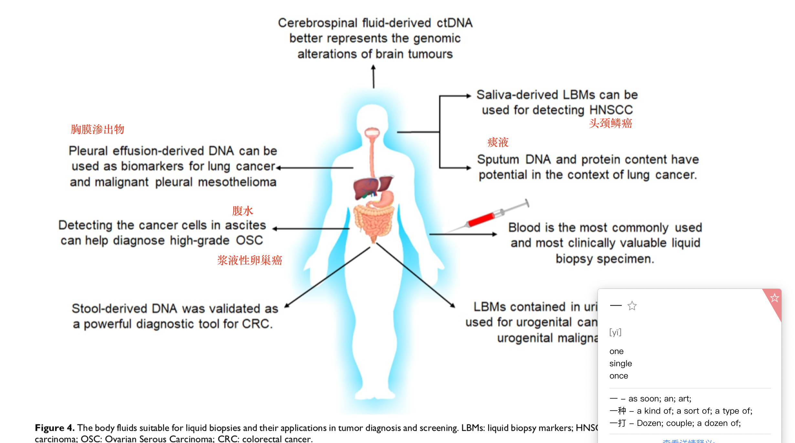

# How to design sample cohort

## I. 什么是队列研究？

队列研究是探讨疾病病因的常用方法之一，其论证强度较高，能较好地揭示两事件间客观存在着的因果关系。

将一群（组）研究对象（队列）按照是否暴露于某研究因素分为暴露组与非暴露组（对照组），随访观察适当长的时间，比较两组之间所研究疾病（或时间）的发病率或死亡率差异，从而判断这个暴露因素与疾病之间有无关联及关联大小的一种观察性研究方法.

“暴露”是指研究对象接触过某种因素（如重金属），或具有某些特征（如年龄、性别、遗传）、行为（如吸烟）。暴露可以是危险因素，也可以是保护因素。

* **前瞻性队列研究 (prospective cohort study)**
是指观察时间从现在开始，追踪观察到将来某个时间，了解其发病或死亡情况，以确定某暴露因素与疾病的关系。研究的结局需随访观察一段时间才能得到，这种研究可信度高、偏倚少，但费时、费人力、物力、财力。

* **回顾性队列研究 (retrospective cohort study)**
是指以过去某个时间为起点，收集基线和暴露资料，以当时人群对研究因素的暴露情况将其分为暴露组和非暴露组，追踪观察到现在发病或死亡的结局情况，以研究暴露与疾病的关系。回顾性队列研究的前提是过去有关暴露与发病的记录必须准确和完整。尽管收集暴露与结局资料的方法是回顾性的，但究其性质而言仍是从因到果的研究方法。

* **病例对照研究 (case-control cohort study)**
病例对照研究是选择患有和未患有某特定疾病的人群分别作为病例组和对照组，调查各组人群过去暴露于某种或某些可疑危险因素的比例或水平，通过比较各组之间暴露比例或水平的差异，判断暴露因素是否与研究的疾病有关联及其关联程度大小的一种观察性研究方法。

## II. 课题设计

### 1. 如组对象（癌症类型）选择

癌症类型的选择是课题设计的第一步，应结合癌症的**1)发病率/致死率；2)恶性程度；3)亟待解决的临床问题；4)样本获取难易程度（是否有稳定、方便、样本质量高的合作单位）**这些方面考虑，并确定不同分期癌症病人的入组比例；应与合作单位临床医生进行大量沟通，了解其需求及可提供的样本类型/病例信息，**尽早开始样本的收集工作。**

### 2. 癌症分布概况

* 2020 cancer statistics-USA

* 2015 cancer statistics-China

**发病率top5 (中国)：** 肺癌、胃癌、食道癌、肝癌、肠癌；占15年所有癌症发病人数的63.7%。

**致死率top5 (中国)：** 肺癌、胃癌、肝癌、食道癌、肠癌；占15年所有癌症死亡人数的74.5%。

> Reference:

* [2020 cancer statistics-USA](https://acsjournals.onlinelibrary.wiley.com/doi/full/10.3322/caac.21590)

* [2015 cancer statistics-China](https://acsjournals.onlinelibrary.wiley.com/doi/10.3322/caac.21338)

### 3. 对照组选择

对照组应最少包含**与癌症病人年龄、性别分布大体一致的cancer-free/healthy donors**；对于有相应慢性疾病的癌症类型，应尽量一并收集其**良性疾病/炎症/癌前病变的样本**，如肝癌对应肝炎和肝硬化、肠癌对应肠道息肉等。

### 4. 病例信息

在与合作单位洽谈样本收集时，应提醒其尽量收集详细的病例信息，尤其是一些必要信息，如**年龄、性别、癌症分期 (如TNM/BCLC)、是否有血管侵犯、肿瘤大小、病理分型(如腺癌、鳞癌、细胞癌)、癌症蛋白标志物水平 (如AFP、CEA、CA19-9)**等。

## III. 入组样本情况

### 1. 样本类型

* 以**血浆**为基础，可以配套收集癌症病人和正常人的**血细胞（PBMC）、血小板（Platelet）、癌组织和癌旁正常组织**等，应在课题设计初，根据课题目标，确定需要用到的样本，并明确其取样方法可以兼容。

* 体液样本类型

> Reference: [2020-Theranostics-Tumor circulome in the liquid biopsies for cancer diagnosis and prognosis](https://www.thno.org/v10p4544.htm)

* 一定注意与合作单位提前沟通。

### 2. 取样时间

* 根据课题的目的（癌症检测 or 预后）来设计取样时间，以下示意图可作为参考。若为预后研究，应尽量详尽的收集，可根据具体情况进行调整，但至少应有手术前后的对照。

### 3. 样本量

* **泛癌检测研究：** 重点研究的癌症类别应至少50～100例，其他癌症最少～30例，正常人样本应约等于癌症样本之和或1/2；可参考CancerSEEK的样本设计(癌症与正常人各约1000例)。

* **单癌症检测研究：** 应针对该癌症设计多种对照组样本。

* **癌症预后研究：** 重点不在样本量大小，而在于信息的全面，若有最少3～5例病人符合以下条件：有较长时间追踪（2年以上）、多个采样时间点取样且病例信息完善、病情有进展（死亡、复发、转移），就是比较难得的临床队列。
